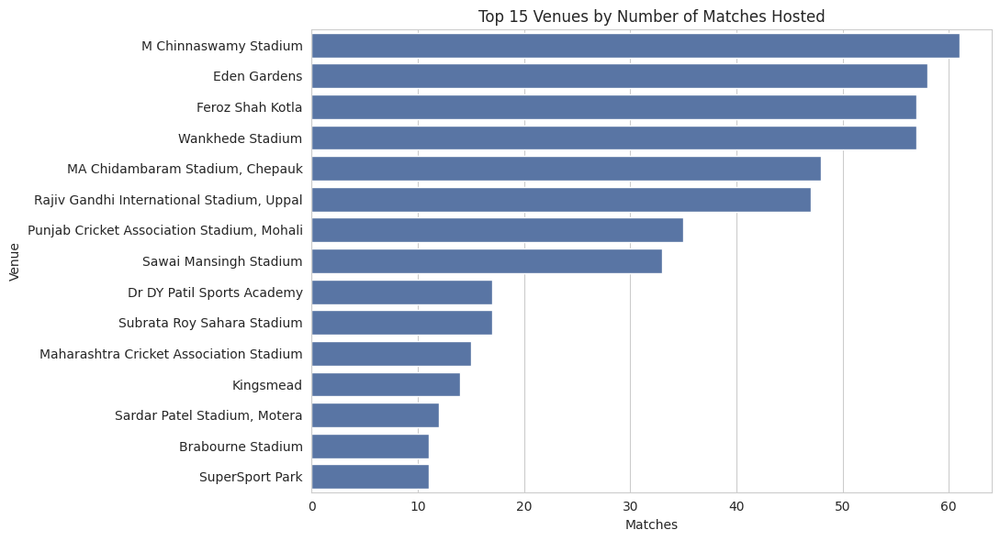
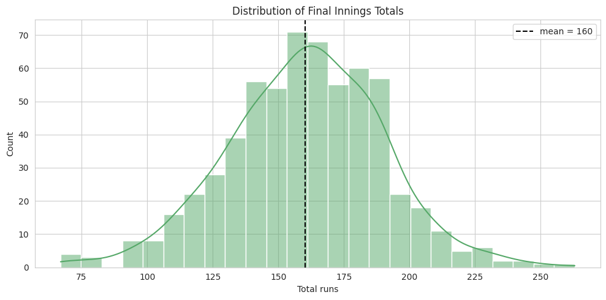
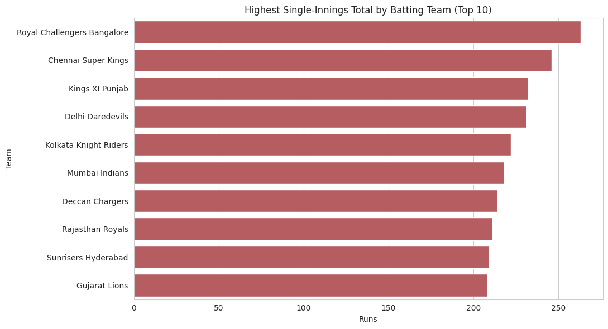
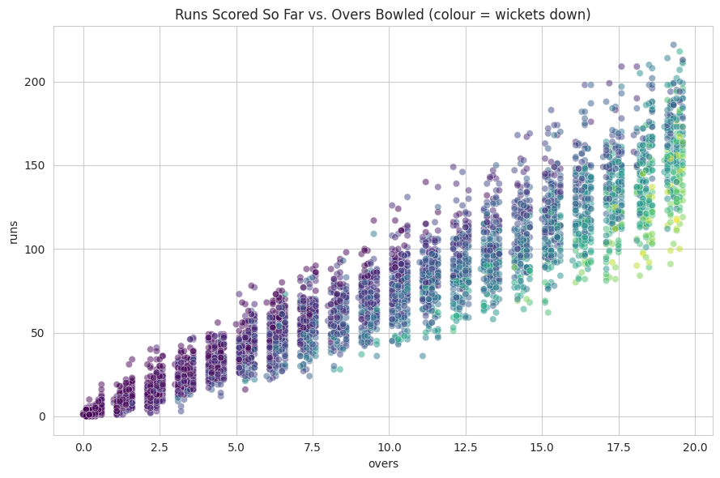
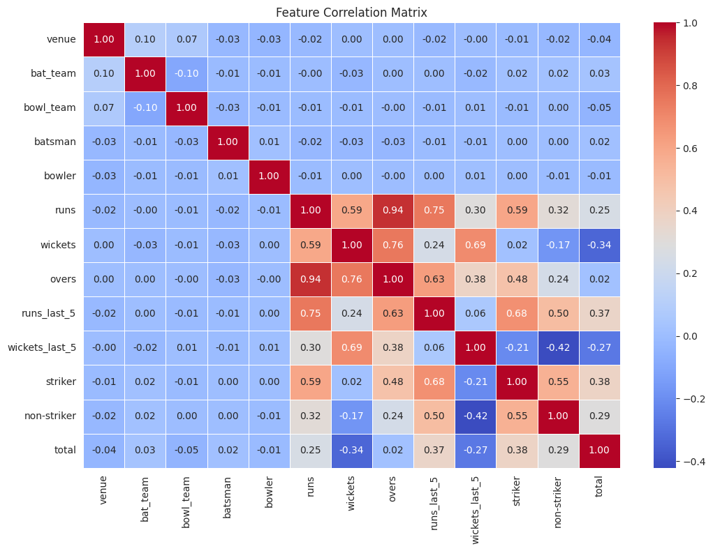
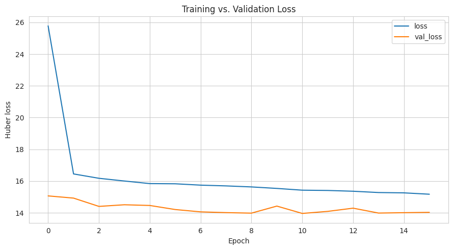
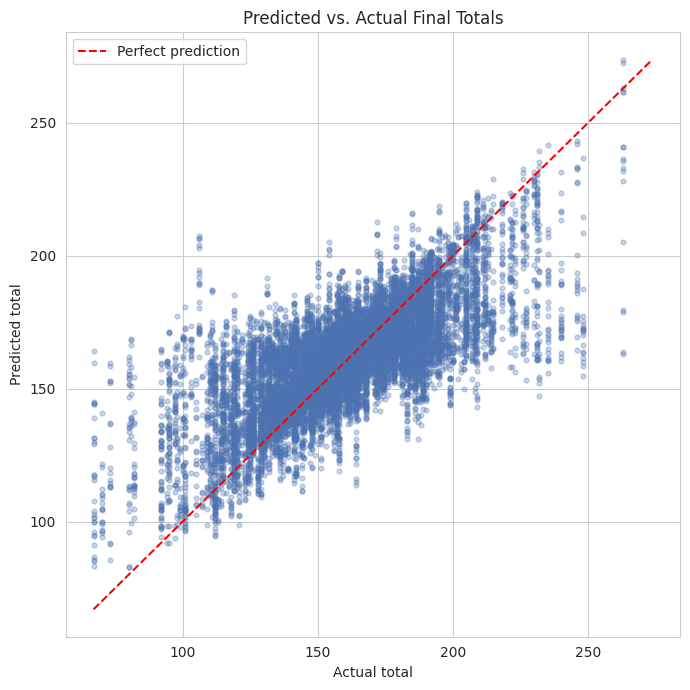

# DL Assignment Repository

This repository holds my day-by-day Deep Learning coursework along with a standalone main project.

## Repository Structure

```
.
├── DAY1 .. DAY9/                # Daily assignments and in-class exercises
├── IPL_Score_Prediction_project.ipynb   # Main project notebook
├── ipl_data.csv                         # Dataset used by the main project
├── IPL-Score-Prediction-with-Deep-Learning.pptx  # Project presentation slides
├── NN_HW.ipynb                  # Neural network homework exercise
├── XOR.ipynb                    # XOR gate learning exercise
├── images/                      # Plots referenced in this README
└── README.md
```

- **`DAY1` – `DAY9`**: Each folder corresponds to a day of coursework and contains the assignments, notes, or exercises completed on that day. These are practice work, not the main deliverable.
- **`IPL_Score_Prediction_project.ipynb`**: The main project for this repository — described in detail below.
- **`ipl_data.csv`**: The dataset that powers the main project.

## Main Project: IPL Score Prediction

This project predicts the **final first-innings total** of an IPL (Indian Premier League) cricket match using a deep learning regression model. Given the current match situation — venue, teams, players, and how many runs/wickets/overs have gone by — the model estimates what the batting side's total score will be by the end of the innings.

### Why this is useful

During a live T20 match, commentators and broadcasters constantly project a team's final score based on the current run rate. This project automates that projection with a neural network trained on historical ball-by-ball IPL data (2008–2017), rather than a simple run-rate extrapolation.

### How it works

1. **Data loading** — `ipl_data.csv` contains ball-by-ball match state: venue, batting/bowling team, batsman, bowler, runs, wickets, overs completed, and the eventual match total.
2. **Exploratory analysis** — Visualizes matches per venue, top-scoring batsmen, most successful bowlers, and the overall distribution of final totals to understand the data before modeling.
3. **Preprocessing** — Categorical fields (teams, venue, players) are label-encoded into numbers, and all features are scaled to a 0–1 range with `MinMaxScaler` so the network trains smoothly.
4. **Model** — A fully-connected (dense) neural network built with **Keras/TensorFlow**, trained to minimize Huber loss (robust to occasional high-scoring outlier innings), with dropout and early stopping to reduce overfitting.
5. **Evaluation** — Performance is measured with MAE, RMSE, and R² on a held-out test set, plus a predicted-vs-actual plot.
6. **Interactive predictor** — An `ipywidgets`-based form lets you pick a venue, batting/bowling team, striker, and bowler, enter the current runs/wickets/overs, and get a live projected final score.

### Tech stack

- **Data handling**: pandas, numpy
- **Visualization**: matplotlib, seaborn
- **Preprocessing & metrics**: scikit-learn (LabelEncoder, MinMaxScaler, train_test_split, MAE/RMSE/R²)
- **Deep learning**: TensorFlow / Keras
- **Interactivity**: ipywidgets

### Running the project

1. Make sure `ipl_data.csv` is in the same directory as `IPL_Score_Prediction_project.ipynb`.
2. Open the notebook in Jupyter or Google Colab.
3. Run all cells in order — the notebook trains the model and launches the interactive score predictor at the end.

### Supporting file

- **`IPL-Score-Prediction-with-Deep-Learning.pptx`**: Slide deck summarizing the project's approach, methodology, and results.

## Results & Visualizations

**Matches hosted per venue** — a look at which stadiums appear most often in the dataset.



**Distribution of final innings totals** — the spread of scores the model is trying to predict.



**Highest single-innings totals by batting team**



**Runs scored vs. overs bowled**, colored by wickets lost — shows how scoring accelerates as an innings progresses.



**Feature correlation heatmap** — used to sanity-check which match-state features relate most strongly to the final total.



**Training vs. validation loss** over epochs, showing the model converging without significant overfitting.



**Predicted vs. actual final totals** on the held-out test set — points closer to the diagonal line indicate more accurate predictions.


